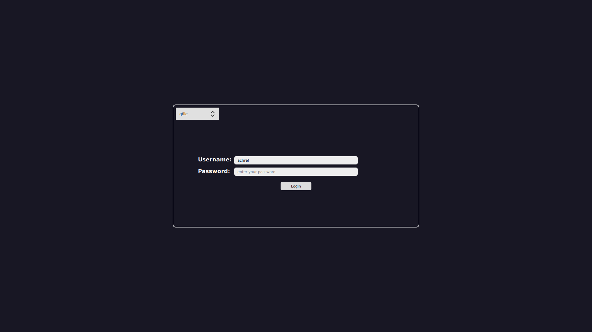

# Gorgeous and Simple Terminal-Like Theme for SDDM



This is a custom theme for SDDM (Simple Desktop Display Manager) that aims to provide a gorgeous and simple terminal-like interface for the login screen.

## Features

- Clean and minimalistic design
- Terminal-inspired layout
- Customizable colors and fonts
- Support for session selection

## Installation

-For Arch Linux:  
Just use you favourite aur helper (example with yay):
```bash
yay -S sddm-terminal-inspired-theme-git 
```

-For other linux distros:
1. Clone or download this repository to your local machine.
2. Add the execute permission to the file (`sessionsDetector.sh`) in the theme folder (`terminal-inspired`):
    ```bash
    chmod +x sessionsDetector.sh
    ```
3. Execute the `sessionsDetector.sh` (p.s: every time that you install a new window manager you will need to do this step): 
    ``` bash
    ./sessionsDetector.sh
    ```
4. Move the theme folder (`terminal-inspired`) to the SDDM themes directory (`/usr/share/sddm/themes/`):
    ```bash
    sudo mv terminal-inspired /usr/share/sddm/themes/
    ```

## Usage

1. Configure SDDM to use the theme by modifying the SDDM configuration file:
   -  go to  `/etc/sddm.conf.d` 
   #create it if it is not there
   - with your favourite editor open the config file in there (again if it doesn't exist create it )
   - Set the `Current` option in the SDDM configuration file to `terminal-inspired`:
   ```ini
   [Theme]
   Current=terminal-inspired
2. Save the configuration file and restart SDDM: `sudo systemctl restart sddm.service`.

## Contributing

Contributions to improve this theme are welcome! If you have any suggestions, bug reports, or feature requests, please open an issue or submit a pull request on GitHub.
## License

This theme is released under the GPL-3.0 License.
